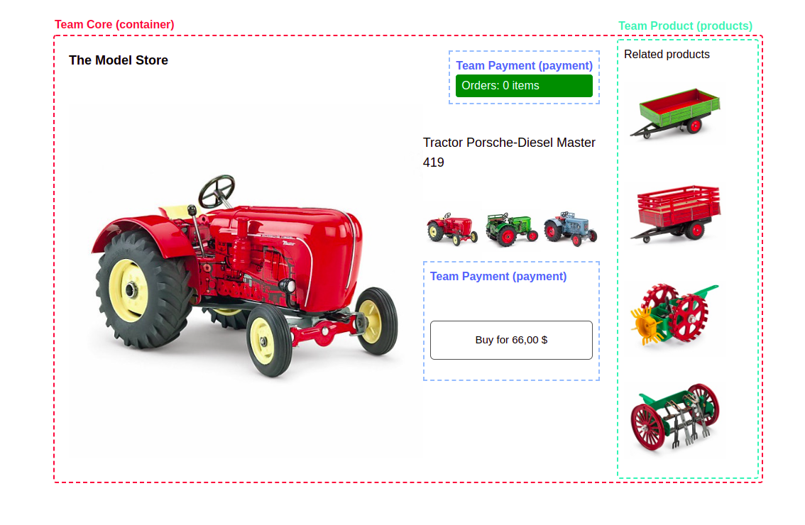

# Micro Frontend Tutorial

Application developed using React, vue and svelte programming languages and Webpack 5's new Module Federation.
In this project, I use tailwindcss to style components.

Easily, put these code into the head tag in html file of each micro app:

```
<link href="https://unpkg.com/tailwindcss@2.2.7/dist/tailwind.min.css" rel="stylesheet" />
```

To create micro frontend applications using Webpack Module Federation, you can follow those steps bellow:

###1. I begin to build Footer application by VueJS:

-   Install following packages:
    

-   In /src, create Footer.vue component

```
<template>
  <div class="m-2 p-5 bg-green-200"> Footer - Vue </div>
</template>
```

-   Create App.vue and import the Footer.vue into the file:

```
<template>
  <div class="text-3xl mx-auto max-w-6xl">
    <Footer/>
  </div>
</template>

<script>
import Footer from './Footer.vue'
export default {
  components:{
    Footer
  }
}
</script>
```

-   Create file bootloader.js

```
import { createApp } from "vue";

// window.headers.get('./Header').then((data) => {
//     const Header = data().default;
//     new Header({
//       target:document.getElementById("header")
//     })
//   })

import "./index.scss";

import App from "./App.vue";

createApp(App).mount("#app");
```

-   Create index.js:

```
import("./bootstrap.js");

```

-   We create mountFooter.js to use Vue Footer component in the future:

```
import { createApp } from "vue";

import Footer from './Footer.vue';

export default (selector) => {
    createApp(Footer).mount(selector);
}

```

-   In the next step, we need to config webpack in webpack.config.js:

```
const HtmlWebPackPlugin = require("html-webpack-plugin");
const ModuleFederationPlugin = require("webpack/lib/container/ModuleFederationPlugin");
const { VueLoaderPlugin } = require("vue-loader");

module.exports = (_, argv) => ({
    output: {
        publicPath:
            argv.mode === "development"
                ? "http://localhost:3002/"
                : "https://luca-webpack-mfe-footer.surge.sh/",
    },

    resolve: {
        extensions: [".tsx", ".ts", ".vue", ".jsx", ".js", ".json"],
    },

    devServer: {
        port: 3002,
        historyApiFallback: true,
        headers: {
            "Access-Control-Allow-Origin": "*",
            "Access-Control-Allow-Methods":
                "GET, POST, PUT, DELETE, PATCH, OPTIONS",
            "Access-Control-Allow-Headers":
                "X-Requested-With, content-type, Authorization",
        },
    },

    module: {
        rules: [
            {
                test: /\.vue$/,
                loader: "vue-loader",
            },
            {
                test: /\.tsx?$/,
                use: [
                    "babel-loader",
                    {
                        loader: "ts-loader",
                        options: {
                            transpileOnly: true,
                            appendTsSuffixTo: ["\\.vue$"],
                            happyPackMode: true,
                        },
                    },
                ],
            },
            {
                test: /\.(css|s[ac]ss)$/i,
                use: ["style-loader", "css-loader", "postcss-loader"],
            },
        ],
    },

    plugins: [
        new VueLoaderPlugin(),
        new ModuleFederationPlugin({
            name: "footers",
            filename: "remoteEntry.js",
            exposes: {
                "./Footer": "./src/Footer.vue",
                "./mountFooter": "./src/mountFooter",
            },
            shared: require("./package.json").dependencies,
        }),
        new HtmlWebPackPlugin({
            template: "./src/index.html",
        }),
    ],
});

```

-   In this file, we need to notice the port in localhost, for this Footer component, I set to PORT 3002.


I named this micro frontend app: footers. You can see in the line:

```
name: "footers",
```

We need to set a name for the chunk file:

```
filename: "remoteEntry.js"
```

To use component from Footer micro app, we need to put it in the "box":

```
exposes: {
    "./Footer": "./src/Footer.vue",
    "./mountFooter": "./src/mountFooter",
},
```

-   Try to run this Footer app by the command:

```
npm start
```


###2. Create micro app "body", this app is the container contains our other micro frontends.

-   Install following packages:
    

-   Similar to Vue app, we mount id #app in bootstrap.js:

```
import React from "react";
import ReactDOM from "react-dom";
import App from "./App";

ReactDOM.render(<App />, document.getElementById("app"));
```

-   Import bootstrap.js file in to index.js:

```
import("./bootstrap");

```

**Important**

-   In index.html, we must have meta tag:

```
        <meta
            http-equiv="Content-Security-Policy"
            content="upgrade-insecure-requests"
        />
```

This way helps our app can run in the production environment. Read more: https://developer.mozilla.org/en-US/docs/Web/HTTP/Headers/Content-Security-Policy/upgrade-insecure-requests

-   Next step, we need to configure webpack.config.js

```
const HtmlWebPackPlugin = require("html-webpack-plugin");
const ModuleFederationPlugin = require("webpack/lib/container/ModuleFederationPlugin");

const deps = require("./package.json").dependencies;

module.exports = (_, argv) => ({
    output: {
        publicPath:
            argv.mode === "development"
                ? "http://localhost:3001/"
                : "https://luca-webpack-mfe-body.surge.sh/",
    },

    resolve: {
        extensions: [".tsx", ".ts", ".jsx", ".js", ".json"],
    },

    devServer: {
        port: 3001,
        historyApiFallback: true,
        headers: {
            "Access-Control-Allow-Origin": "*",
            "Access-Control-Allow-Methods":
                "GET, POST, PUT, DELETE, PATCH, OPTIONS",
            "Access-Control-Allow-Headers":
                "X-Requested-With, content-type, Authorization",
        },
    },

    module: {
        rules: [
            {
                test: /\.m?js/,
                type: "javascript/auto",
                resolve: {
                    fullySpecified: false,
                },
            },
            {
                test: /\.(css|s[ac]ss)$/i,
                use: ["style-loader", "css-loader", "postcss-loader"],
            },
            {
                test: /\.(ts|tsx|js|jsx)$/,
                exclude: /node_modules/,
                use: {
                    loader: "babel-loader",
                },
            },
        ],
    },

    plugins: [
        new ModuleFederationPlugin({
            name: "body",
            filename: "remoteEntry.js",
            // remotes: {
            //     footer:
            //         argv.mode === "development"
            //             ? "footers@http://localhost:3002/remoteEntry.js"
            //             : "footers@https://luca-webpack-mfe-footer.surge.sh/remoteEntry.js",
            //     header:
            //         argv.mode === "development"
            //             ? "headers@http://localhost:8080/remoteEntry.js"
            //             : "headers@https://luca-webpack-mfe-header.surge.sh/remoteEntry.js",
            //     products:
            //         argv.mode === "development"
            //             ? "Products@http://localhost:3003/remoteEntry.js"
            //             : "Products@https://luca-webpack-mfe-products.surge.sh/remoteEntry.js",
            //     common:
            //         argv.mode === "development"
            //             ? "Common@http://localhost:3004/remoteEntry.js"
            //             : "Common@https://luca-webpack-mfe-common.surge.sh/remoteEntry.js",
            // },
            remotes: {
                footer: "footers@https://luca-webpack-mfe-footer.surge.sh/remoteEntry.js",
                // header: "headers@https://luca-webpack-mfe-header.surge.sh/remoteEntry.js",
                products:
                    "Products@https://luca-webpack-mfe-products.surge.sh/remoteEntry.js",
                common: "Common@https://luca-webpack-mfe-common.surge.sh/remoteEntry.js",
            },
            exposes: {},
            shared: {
                ...deps,
                react: {
                    singleton: true,
                    requiredVersion: deps.react,
                },
                "react-dom": {
                    singleton: true,
                    requiredVersion: deps["react-dom"],
                },
            },
        }),
        new HtmlWebPackPlugin({
            template: "./src/index.html",
        }),
    ],
});

```

-   The main app in PORT 3001
    I named this micro frontend app: body. You can see in the line:

```
name: "body",
```

We need to set a name for the chunk file:

```
filename: "remoteEntry.js"
```

To use micro app in body, set remotes line:

```
            remotes: {
                footer: "footers@https://luca-webpack-mfe-footer.surge.sh/remoteEntry.js",
                // header: "headers@https://luca-webpack-mfe-header.surge.sh/remoteEntry.js",
                products:
                    "Products@https://luca-webpack-mfe-products.surge.sh/remoteEntry.js",
                common: "Common@https://luca-webpack-mfe-common.surge.sh/remoteEntry.js",
            },
```

-   In App.jsx:

```
import mountFooter from "footer/mountFooter";
const RelatedProducts = React.lazy(() => import("products/App"));

const ReactButton = React.lazy(() => import("common/ReactButton"));
const AmountItem = React.lazy(() => import("common/AmountItem"));
```

After importing components, we can use them in body micro-app

### Noted:

If 2 micro-apps are 1 framework / library, you can use them directly.

```
const RelatedProducts = React.lazy(() => import("products/App"));

```

Otherwise, if 1 app built in ReactJS, another app built in VueJS, you must mount the component to the DOM to use. Because Webpack Module Federation need times to load data, we import mounting component to use micro app indirectly.

```
mountFooter("#footer");
```

In index.html file:

```
    <body>
        <!-- <div id="header"></div> -->
        <div id="app"></div>
        <div id="footer"></div>
    </body>
```

### Final Result



## Installation

Install the dependencies and devDependencies and start the server.

```sh
cd headers
npm install
npm start
```

```sh
cd body
npm install
npm start
```

```sh
cd products
npm install
npm start
```

```sh
cd footer
npm install
npm start
```

```sh
cd common
npm install
npm start

```

## Tech

| Prog. Lang. | PORT              |
| ----------- | ----------------- |
| REACTJS     | :3002 :3003 :3004 |
| VUEJS       | :3001             |
| SVELTEJS    | :8080             |

---

Deployment:
I use Surge.sh to deploy the applications.

| Page     | Link                                        |
| -------- | ------------------------------------------- |
| body     | https://luca-webpack-mfe-body.surge.sh/     |
| products | https://luca-webpack-mfe-products.surge.sh/ |
| header   | https://luca-webpack-mfe-header.surge.sh/   |
| footer   | https://luca-webpack-mfe-footer.surge.sh/   |
| common   | https://luca-webpack-mfe-common.surge.sh/   |

## License

MIT
